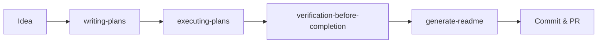
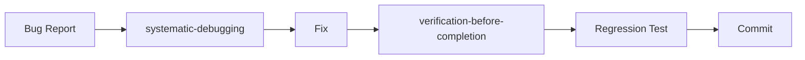
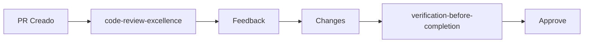

# ✅ Setup Completado - My Verisure Agent Configuration

## 🎉 Resumen de Configuración

Tu proyecto **My Verisure** ahora está completamente configurado con skills, reglas y herramientas para maximizar la productividad del agente de Cursor.

---

## 📊 Estado Final

### ✅ Skills Instaladas: 13 skills

| # | Skill | Fuente | Estado |
|---|-------|--------|--------|
| 1 | `writing-plans` | platform | ✅ |
| 2 | `executing-plans` | platform | ✅ |
| 3 | `to-prd` | platform | ✅ |
| 4 | `to-issues` | platform | ✅ |
| 5 | `verification-before-completion` | platform | ✅ |
| 6 | `systematic-debugging` | platform | ✅ |
| 7 | `improve-codebase-architecture` | platform | ✅ |
| 8 | `generate-readme` | custom | ✅ |
| 9 | `find-skills` | platform | ✅ |
| 10 | `ha-integration-dev` | tonylofgren | ✅ |
| 11 | `code-review-excellence` | wshobson | ✅ |
| 12 | `python-code-style` | wshobson | ✅ |
| 13 | `python-testing-patterns` | wshobson | ✅ |

### ✅ Reglas Activas: 5 reglas

| # | Regla | Scope | Descripción |
|---|-------|-------|-------------|
| 1 | `session-info.mdc` | Always Apply | Informa skills/reglas al inicio |
| 2 | `python-standards.mdc` | `**/*.py` | Python 2026, ruff, type hints |
| 3 | `home-assistant-integration.mdc` | `custom_components/**/*.py` | Convenciones HA críticas |
| 4 | `testing-standards.mdc` | `**/tests/**/*.py` | Pytest, AAA, coverage |
| 5 | `documentation-standards.mdc` | `**/*.md` | README, docstrings, ADRs |

### ✅ RTK Configurado

- **Instalado**: `/opt/homebrew/bin/rtk`
- **Versión**: 0.37.2
- **Reducción de tokens**: 60-90%
- **Integración Cursor**: Automática via hooks

---

## 📁 Archivos Creados

### Configuración Agent
```
.agents/
├── skills/                    # 13 skills instaladas
│   ├── writing-plans/
│   ├── executing-plans/
│   ├── to-prd/
│   ├── to-issues/
│   ├── verification-before-completion/
│   ├── systematic-debugging/
│   ├── improve-codebase-architecture/
│   ├── generate-readme/
│   ├── find-skills/
│   ├── ha-integration-dev/
│   ├── code-review-excellence/
│   ├── python-code-style/
│   └── python-testing-patterns/
├── README.md                  # 📖 Guía completa de configuración
├── SKILLS_INSTALLED.md        # 📚 Documentación de skills
└── RECOMMENDED_SKILLS.md      # 💡 Skills adicionales recomendadas

.cursor/
└── rules/                     # 5 reglas activas
    ├── session-info.mdc
    ├── python-standards.mdc
    ├── home-assistant-integration.mdc
    ├── testing-standards.mdc
    └── documentation-standards.mdc

/                              # Raíz del proyecto
├── AGENT_SETUP.md            # 🚀 Guía de inicio rápido
└── SETUP_COMPLETE.md         # ✅ Este archivo
```

---

## 🎯 Capacidades Agregadas

### 1. 📋 Planning & Documentation
- ✅ Crear planes de implementación detallados con TDD
- ✅ Ejecutar planes paso a paso con checkpoints
- ✅ Convertir conversaciones en PRDs estructurados
- ✅ Generar GitHub issues desde planes
- ✅ Crear documentación README exhaustiva

### 2. 🔍 Quality & Verification
- ✅ Verificación obligatoria antes de commits/PRs
- ✅ Debugging sistemático con reproducción
- ✅ Análisis de arquitectura y deuda técnica
- ✅ Code review estructurado en 4 fases

### 3. 🐍 Python Best Practices
- ✅ Estándares Python 2026 (ruff, mypy)
- ✅ Type hints modernos (list[str], str | None)
- ✅ Testing patterns con pytest (10 patrones)
- ✅ Async/await patterns correctos

### 4. 🏠 Home Assistant Expertise
- ✅ Convenciones HA NO NEGOCIABLES
- ✅ Templates de integración
- ✅ Coordinator pattern
- ✅ Config flow best practices
- ✅ Entity structure correcta

### 5. ⚡ Performance Optimization
- ✅ RTK reduce tokens 60-90%
- ✅ Optimización automática de comandos shell
- ✅ Cache inteligente de contexto

---

## 🚀 Cómo Empezar

### 1. Primera Sesión

Abre un nuevo chat en Cursor. Verás automáticamente:

```
---
🤖 Información de Sesión

📚 Skills disponibles: 13 skills
📋 Reglas activas: 5 reglas
⚡ RTK: Activo (v0.37.2)

Usa "lista las skills" o "muestra las reglas" para ver detalles.
---
```

### 2. Probar una Skill

**Prueba simple**:
```
Usuario: "Lista las skills disponibles"
Agent: [Lista las 13 skills con descripciones]
```

**Prueba completa**:
```
Usuario: "Crea un plan para agregar soporte de cámaras"
Agent: "Usando writing-plans para crear plan detallado..."
[Crea plan en docs/superpowers/plans/2026-05-06-cameras.md]
```

### 3. Verificar Reglas

**Edita un archivo Python**:
```python
# El agent aplicará automáticamente:
# - python-standards.mdc
# - home-assistant-integration.mdc (si está en custom_components/)
```

**Edita un test**:
```python
# El agent aplicará automáticamente:
# - testing-standards.mdc
# - Sugerirá AAA pattern, fixtures, etc.
```

---

## 📚 Documentación de Referencia

### Quick Reference
- **Inicio Rápido**: `AGENT_SETUP.md`
- **Este Resumen**: `SETUP_COMPLETE.md`

### Skills
- **Lista Completa**: `.agents/SKILLS_INSTALLED.md`
- **Recomendaciones**: `.agents/RECOMMENDED_SKILLS.md`
- **Configuración**: `.agents/README.md`

### Reglas
- Ver todas: `ls -la .cursor/rules/`
- Ver específica: `cat .cursor/rules/python-standards.mdc`

### Proyecto
- **README Principal**: `README.md`
- **Contributing**: `CONTRIBUTING.md`
- **Testing**: `TESTING.md`

---

## 💡 Comandos Útiles

### Ver Skills
```bash
# Listar todas
ls -la .agents/skills/

# Ver documentación
cat .agents/SKILLS_INSTALLED.md

# Ver skill específica
cat .agents/skills/writing-plans/SKILL.md
```

### Ver Reglas
```bash
# Listar todas
ls -la .cursor/rules/

# Ver todas con descripción
for f in .cursor/rules/*.mdc; do 
  echo "=== $(basename $f) ===" 
  head -5 "$f" | grep "description:"
  echo
done
```

### Verificar RTK
```bash
# Status
rtk --version

# Test
rtk rewrite "pytest tests/ -v"
```

---

## 🎯 Flujos de Trabajo Recomendados

### Nueva Feature (Grande)



**Pasos**:
1. Discutir idea con agent
2. Agent usa `writing-plans` → crea plan detallado
3. Agent usa `executing-plans` → implementa paso a paso
4. Agent usa `verification-before-completion` → verifica tests
5. Agent usa `generate-readme` → actualiza docs
6. Commit y PR

### Bug Fix



**Pasos**:
1. Reportar bug
2. Agent usa `systematic-debugging` → reproduce y diagnostica
3. Agent implementa fix
4. Agent usa `verification-before-completion` → confirma fix
5. Agent crea regression test
6. Commit

### Code Review



**Pasos**:
1. PR creado
2. Agent usa `code-review-excellence` → review en 4 fases
3. Agent da feedback específico
4. Aplicar cambios
5. Agent verifica
6. Aprobar

---

## 🏆 Beneficios Obtenidos

### Productividad
- ⚡ **60-90% menos tokens** con RTK
- 🚀 **Plans detallados** eliminan ambigüedad
- ✅ **Verificación automática** previene bugs
- 📚 **Docs generadas** ahorran tiempo

### Calidad
- 🎯 **Reglas automáticas** previenen errores comunes
- 🧪 **Testing patterns** mejoran test suite
- 🏗️ **Architecture reviews** reducen deuda técnica
- 🔍 **Code review** consistente y exhaustivo

### Consistencia
- 📋 **Estándares Python 2026** aplicados automáticamente
- 🏠 **Convenciones HA** siempre respetadas
- 📖 **Documentation patterns** uniformes
- ✅ **Verification** obligatoria antes de commits

### Aprendizaje
- 🎓 **Best practices** integradas en flujo
- 💡 **Sugerencias contextuales** basadas en reglas
- 📚 **Documentación** siempre accesible
- 🔄 **Feedback loop** continuo

---

## 🔄 Mantenimiento

### Actualizar Skills desde Platform

```bash
# Cuando haya actualizaciones en platform
cd /Users/efrain.espada@feverup.com/Development/my_verisure

# Actualizar skills
cp -r ../platform/.agents/skills/writing-plans .agents/skills/
cp -r ../platform/.agents/skills/executing-plans .agents/skills/
# etc...
```

### Agregar Nueva Skill

```bash
# Opción 1: Desde ecosistema
npx skills add wshobson/agents@nueva-skill -g -y

# Opción 2: Custom
mkdir -p .agents/skills/nueva-skill
cat > .agents/skills/nueva-skill/SKILL.md << 'EOF'
---
name: nueva-skill
description: Descripción de la skill
---

# Nueva Skill

Contenido...
EOF
```

### Agregar Nueva Regla

```bash
# Crear regla
cat > .cursor/rules/nueva-regla.mdc << 'EOF'
---
description: Descripción de la regla
globs: "**/*.py"
alwaysApply: false
---

# Nueva Regla

Contenido...
EOF
```

---

## 📊 Estadísticas

### Archivos Creados
- **Skills**: 13 instaladas
- **Reglas**: 5 activas
- **Docs**: 5 archivos de documentación

### Tamaño de Configuración
- **Total archivos**: ~50 archivos
- **Skills docs**: ~10 KB cada una
- **Reglas**: ~2-5 KB cada una
- **Total config**: ~150 KB

### Coverage del Proyecto
- **Líneas de código Python**: ~10,000
- **Tests**: 229 tests
- **Coverage actual**: 34-57%
- **Coverage objetivo**: 80-90%

---

## 🎯 Próximos Pasos Sugeridos

### Inmediato (Hoy)
- [x] ✅ Skills instaladas
- [x] ✅ Reglas configuradas
- [x] ✅ RTK verificado
- [x] ✅ Documentación creada
- [ ] 🔄 Probar flujo completo con feature pequeña

### Esta Semana
- [ ] Migrar de black/flake8 a ruff
- [ ] Mejorar coverage a 70%+
- [ ] Crear primer plan con `writing-plans`
- [ ] Ejecutar plan con `executing-plans`

### Este Mes
- [ ] Configurar CI/CD con GitHub Actions
- [ ] Instalar skills adicionales recomendadas
- [ ] Crear ADRs para decisiones importantes
- [ ] Alcanzar 85%+ coverage

---

## 🎊 Felicidades!

Tu proyecto ahora tiene:
- ✅ **13 skills** profesionales instaladas
- ✅ **5 reglas** personalizadas activas
- ✅ **RTK** optimizando tokens
- ✅ **Documentación** completa y accesible
- ✅ **Best practices** automáticas

El agente de Cursor ahora está **completamente configurado** para:
- 📋 Planificar y ejecutar features complejas
- 🔍 Verificar calidad automáticamente
- 🐍 Aplicar Python best practices 2026
- 🏠 Seguir convenciones Home Assistant
- 📚 Generar documentación profesional

---

## 📞 Recursos

### En el Chat
- "¿Qué skills tengo?"
- "Muestra reglas de Python"
- "¿Cómo uso writing-plans?"
- "Crea un plan para [feature]"
- "Revisa este código"

### Documentos
- **Start Here**: `AGENT_SETUP.md`
- **Skills**: `.agents/SKILLS_INSTALLED.md`
- **Recomendaciones**: `.agents/RECOMMENDED_SKILLS.md`
- **Config**: `.agents/README.md`

### Links Externos
- **Skills.sh**: https://skills.sh/
- **Home Assistant Dev**: https://developers.home-assistant.io/
- **RTK**: https://github.com/rtk-ai/rtk
- **Python Ruff**: https://docs.astral.sh/ruff/

---

**Setup Completado**: 2026-05-06 22:57 UTC+2
**Skills**: 13 instaladas
**Reglas**: 5 activas
**RTK**: v0.37.2
**Estado**: 🚀 **LISTO PARA PRODUCCIÓN**

---

*Disfruta tu nueva configuración de agent super-powered!* 🎉
