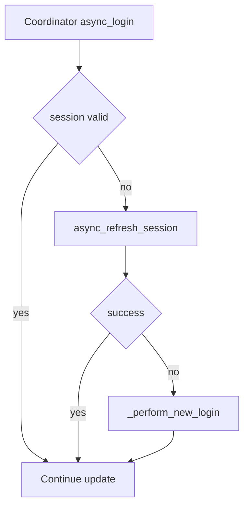

# Diagram — authentication refresh

```mermaid
flowchart TD
  start[Coordinator async_login]
  valid{session valid}
  refresh[async_refresh_session]
  login[_perform_new_login]
  ok{success}

  start --> valid
  valid -->|yes| done[Continue update]
  valid -->|no| refresh
  refresh --> ok
  ok -->|yes| done
  ok -->|no| login
  login --> done
```
