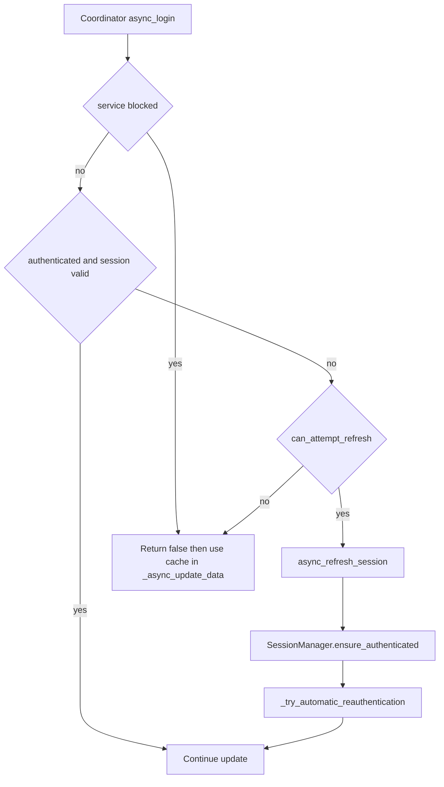

# Diagram — authentication refresh

```mermaid
flowchart TD
  start[Coordinator async_login]
  blocked{service blocked}
  valid{authenticated and session valid}
  canRefresh{can_attempt_refresh}
  refresh[async_refresh_session]
  ensure[SessionManager.ensure_authenticated]
  reauth[_try_automatic_reauthentication]
  done[Continue update]
  cache[Return false then use cache in _async_update_data]

  start --> blocked
  blocked -->|yes| cache
  blocked -->|no| valid
  valid -->|yes| done
  valid -->|no| canRefresh
  canRefresh -->|no| cache
  canRefresh -->|yes| refresh
  refresh --> ensure
  ensure --> reauth
  reauth --> done
```
