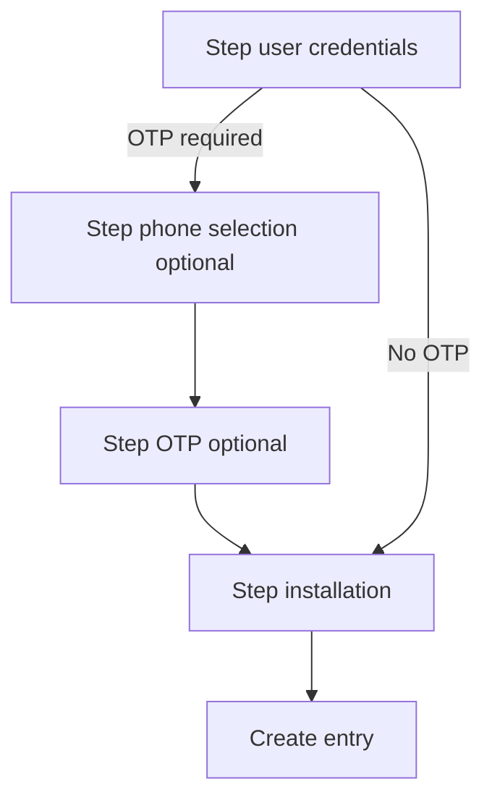

# Diagram — config flow (simplified)

```mermaid
flowchart TD
  user[Step user credentials]
  otpPhones[Step phone selection optional]
  otpCode[Step OTP optional]
  pickInst[Step installation]
  done[Create entry]

  user -->|OTP required| otpPhones
  otpPhones --> otpCode
  otpCode --> pickInst
  user -->|No OTP| pickInst
  pickInst --> done
```
