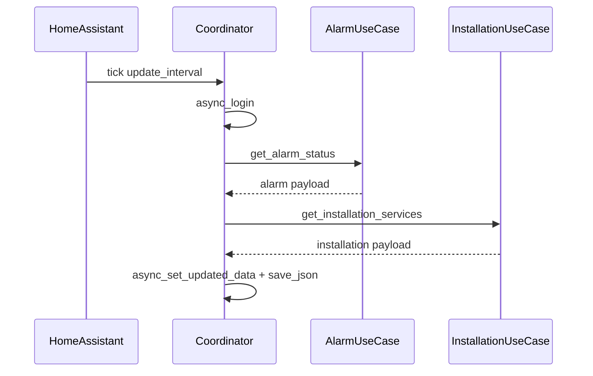

# Diagram — coordinator poll sequence

```mermaid
sequenceDiagram
  participant HA as HomeAssistant
  participant C as Coordinator
  participant A as AlarmUseCase
  participant I as InstallationUseCase
  HA->>C: tick update_interval
  C->>C: async_login
  C->>A: get_alarm_status
  A-->>C: alarm payload
  C->>I: get_installation_services
  I-->>C: installation payload
  C->>C: async_set_updated_data + save_json
```
