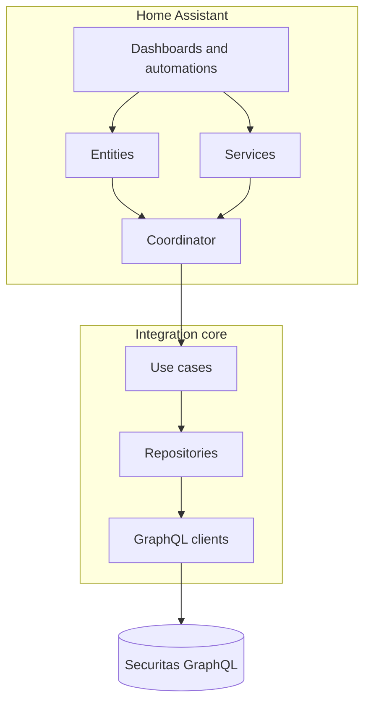

# Overview

My Verisure is a **cloud-polled hub integration**. Home Assistant entities reflect remote alarm state; commands round-trip through Securitas GraphQL.

**Integration types:** `integration_type: hub` in [`manifest.json`](../../custom_components/my_verisure/manifest.json).  
**IoT class:** `cloud_polling`.
