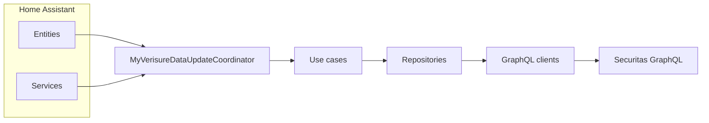

# Architecture (developer overview)

1. **Entities & services** call coordinator methods or read `coordinator.data`.  
2. **Coordinator** ensures login, pulls alarm + installation payloads on each poll, persists snapshot JSON (`COORDINATOR_DATA_FILE`).  
3. **Use cases** encapsulate operational workflows (arm/disarm, list installations, refresh cameras).  
4. **Repositories** isolate GraphQL detail from use cases.  
5. **BaseClient** executes HTTP GraphQL with auth headers from `SessionManager`.

For layered detail see [Architecture docs](../architecture/layers.md).
